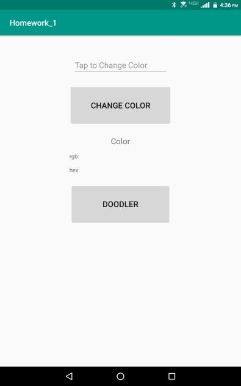
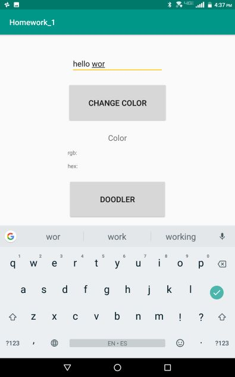
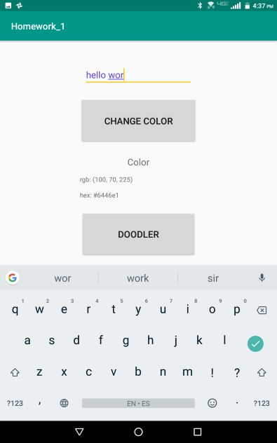
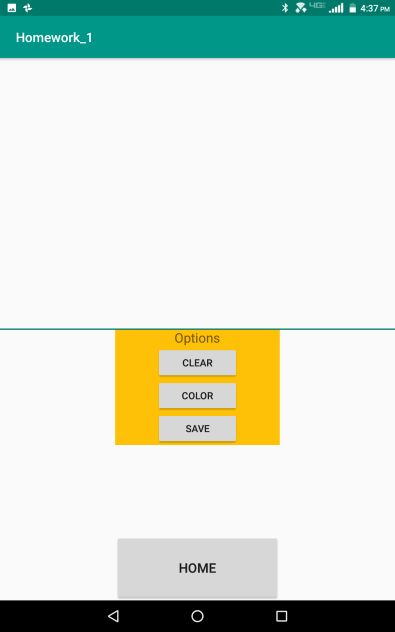
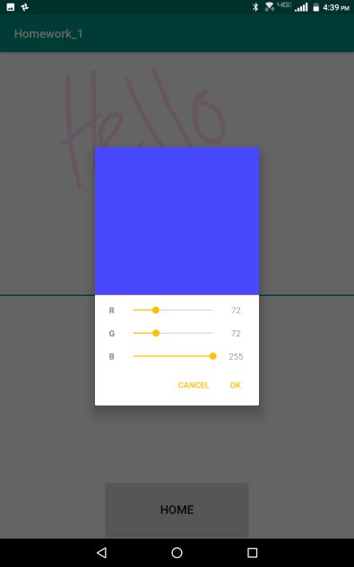
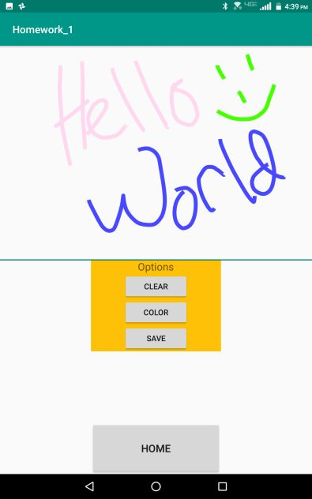
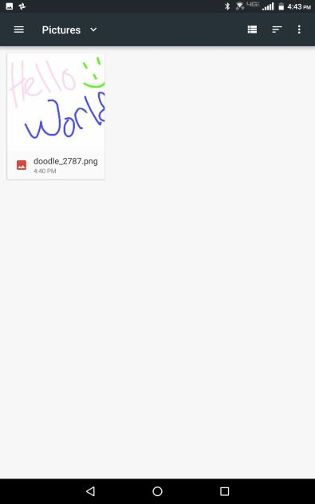

# Homework 1

[Project Link (Github)](https://github.com/natedunn2230/Homework_1)

##### Nathan Dunn
##### Dr. Doran
##### CEG 4110-01

### App Overview
Homework 1 is an Android application consisting of two parts:

+ ##### *Part One*
  Allows the user to change the color of text they enter into a text field. The values of the colors are displayed in hexadecimal and rgb.
+ ##### *Part Two*
  Contains a drawing panel that the user can doodle on.  The doodle can be saved to the device running the application. The user can clear the panel when desired and draw in a variety of colors with a color picker.

### Deployment Instructions

**_Deployment does not rely on extra resources_**

1. Connect an android device to the computer and run in *File Transfer Mode (MTP)*.
2. On the android device, go to settings->security and make sure *Unknown sources* is turned on. This allows the device to install apps from unknown sources, such as this application.
3. After extracting *Homework_1_ndunn.tar.gz*, a file titled *Homework_1.apk* can be found inside the "bin" folder. 
4. Drag *Homework_1.apk* into the root directory of the android device.
5. On the android device, go to Files/File Manager. Under the root directory, *Homework_1.apk* should be visible. Click on it and open it to start the installation process.
6. Once the installation process is complete, proceed to the application instructions.

### Application Instructions

 + ##### *Part One*	

|  |
| :------------------------------ |
| *User Interface*                |

|                         |
| :----------------------------------------------------------- |
| *Tapping the text field allows the user to type in anything they desire.* |

|                      |
| :----------------------------------------------------------- |
| *Tapping "Change Color" button changes the text of the user typed in and displays the color values in RGB and hexadecimal.  Clicking the "Doodler" button will take the user to part two of the homework application.* |

+ ##### *Part Two*

|  |
| :--------------------------------- |
| *User Interface*                   |

|                      |
| :----------------------------------------------------------- |
| *The top half of the screen serves as a canvas to paint on. If the user wishes to change colors, they can select the "color" button to do so.* |

|                      |
| :----------------------------------------------------------- |
| *The color picker allows the user to select a color using RGB.* |

|                        |
| :----------------------------------------------------------- |
| *After drawing a colorful picture, the user has the option to clear the canvas to restart, or save the image.* |

|                |
| :----------------------------------------------------------- |
| *In order to view a saved drawing, the user can navigate to downloads (or files, depending on OS version) and under images, the drawing  can be found.* |

### Design Patterns

##### *Included Libraries*

+ [Chroma](https://github.com/ItsPriyesh/chroma), By ItsPriyesh. A color picker library.

##### *Class Functionality*

