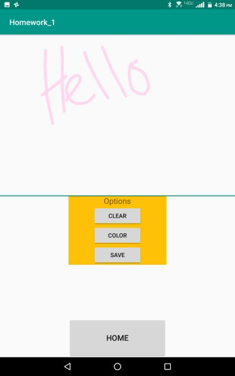

# Homework 1

[Project Link (Github)](https://github.com/natedunn2230/Homework_1)

##### Nathan Dunn
##### Dr. Doran
##### CEG 4110-01

### App Overview
Homework 1 is an Android application consisting of two parts:

+ ##### *Part One*
  Allows the user to change the color of text they enter into a text field. The values of the colors are displayed in hexadecimal and RGB.
+ ##### *Part Two*
  Contains a drawing panel that the user can doodle on.  The doodle can be saved to the device running the application. The user can clear the panel when desired and draw in a variety of colors with a color picker.

### Deployment Instructions

**_Deployment does not rely on extra resources_**

1. Connect an android device to the computer and run in *File Transfer Mode (MTP)*.
2. On the android device, go to settings->security and make sure *Unknown sources* is turned on. This allows the device to install apps from unknown sources, such as this application.
3. After extracting *Homework_1_ndunn.tar.gz*, a file titled *Homework_1.apk* can be found inside the "bin" folder. 
4. Drag *Homework_1.apk* into the root directory of the android device.
5. On the android device, go to Files/File Manager. Under the root directory, *Homework_1.apk* should be visible. Click on it and open it to start the installation process.
6. Once the installation process is complete, proceed to the application instructions.

### Application Instructions

 + ##### *Part One*	

|  |
| :------------------------------ |
| *User Interface*                |

|                         |
| :----------------------------------------------------------- |
| *Tapping the text field allows the user to type in anything they desire.* |

|                      |
| :----------------------------------------------------------- |
| *Tapping "Change Color" button changes the text of the user typed in and displays the color values in RGB and hexadecimal.  Clicking the "Doodler" button will take the user to part two of the homework application.* |

+ ##### *Part Two*

|  |
| :--------------------------------- |
| *User Interface*                   |

|                      |
| :----------------------------------------------------------- |
| *The top half of the screen serves as a canvas to paint on. If the user wishes to change colors, they can select the "color" button to do so.* |

|                      |
| :----------------------------------------------------------- |
| *The color picker allows the user to select a color using RGB.* |

|                        |
| :----------------------------------------------------------- |
| *After drawing a colorful picture, the user has the option to clear the canvas to restart, or save the image.* |

|                |
| :----------------------------------------------------------- |
| *In order to view a saved drawing, the user can navigate to downloads (or files, depending on OS version) and under images, the drawing can be found in a folder titled **pictures**.* |

### Design Patterns

I decided to implement Activity classes (android defaults to this), to handle application state and scenes. Other classes, such as DoodleBoard and Line were built to implement into scenes for the user to interact with.

##### *Included Libraries*

+ [Chroma](https://github.com/ItsPriyesh/chroma), By ItsPriyesh. A color picker library.

##### *Class Functionality*

+ *_MainActivity_*.java
  + The purpose of this class is to set the instance of an activity (scene) for part one of the application. Buttons and other widgets created in *main_activity.xml* (layout/styling file) can be referenced and stored as variables in this class. User interaction, such as on click handlers are also implemented. This class holds logic for creating random colors for the text field and updating  text to display the values of the random colors.  
+ DoodleActivity.java
  + This class is very similar to *MainActivity.java* in the sense that it holds references to widgets from its layout file, *doodle_activity.xml* and handles user interaction. This class implements a method called *saveImage* which saves the drawing that the user has created. Also within this class, the application asks the user for permission to access its device's storage. The color picker logic is housed in the file and sends selected colors to the *DoodleBoard.java* class.
+ Line.java
  + Line holds two android graphics classes: *Paint* and *Path*. Paint acts like a painter's brush and contains attributes such as stroke width, color, transparency, etc. Path holds the coordinates that the Paint draws to the screen, essentially creating a "path"  of paint values. Mapping these together in an array (In *DoodleBoard*) allows me to create a panel that supports multiple colors.  A new "line" object is created every time the user places their finger on the screen.

+ DoodleBoard.java
  + This class holds the structure and logic contained within the drawing board. Using the built-in android graphics library, I constructed an interactive drawing panel.  This class contains methods such as *onDraw* which draws my custom Lines(referenced above) to the screen, and *onTouchEvent*, which handles user input on the panel, such as the user dragging their finger across the screen. 

